# Active Directory Home Lab

A virtualized Windows enterprise environment built to practice system administration, networking, identity management, and security.

## Project Overview

This project documents the design and deployment of an isolated Active Directory home lab using Hyper-V.

The environment currently includes a Windows Server 2025 Domain Controller and a Windows 11 Pro client. The lab will be expanded to demonstrate user and group administration, Organizational Units, Group Policy, security controls, and troubleshooting.

## Lab Environment

### Host Computer

- Windows 11 Pro
- Hyper-V virtualization
- AMD Ryzen 9 7950X
- 32 GB RAM

### Virtual Network

- Hyper-V internal virtual switch
- Switch name: `AD-Lab`
- Network: `10.10.10.0/24`
- Isolated from the physical home network

### Network Topology

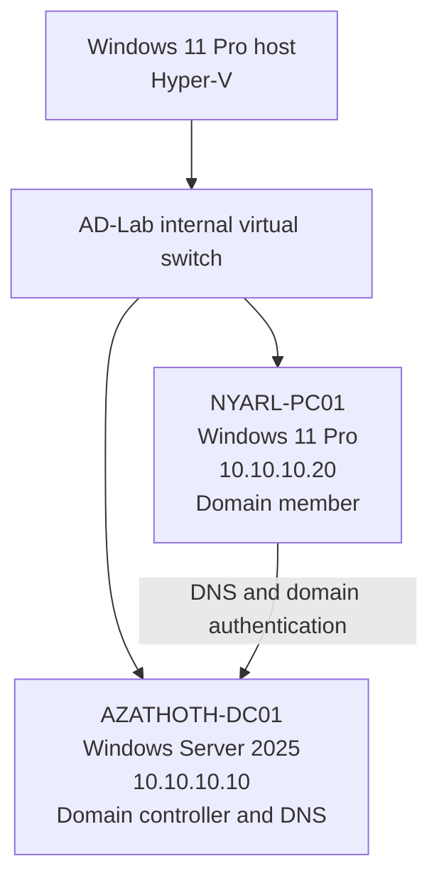

The internal Hyper-V switch isolates the lab from the physical home network. NYARL-PC01 uses AZATHOTH-DC01 for Domain Name System (DNS) resolution and domain authentication.

## Virtual Machines

| Device | Operating System | Role | IP Address | DNS Server |
|---|---|---|---|---|
| `AZATHOTH-DC01` | Windows Server 2025 Standard Evaluation | Domain Controller and DNS server | `10.10.10.10` | `10.10.10.10` |
| `NYARL-PC01` | Windows 11 Pro | Domain client | `10.10.10.20` | `10.10.10.10` |

### Domain Controller Configuration

- Computer name: `AZATHOTH-DC01`
- Domain: `azathoth.lab`
- Active Directory Domain Services (AD DS)
- Domain Name System (DNS)
- Generation 2 Hyper-V virtual machine
- 2 virtual processors
- 4 GB startup memory
- 80 GB dynamically expanding virtual hard disk
- Secure Boot enabled

### Windows Client Configuration

- Computer name: `NYARL-PC01`
- Windows 11 Pro
- Static IPv4 address: `10.10.10.20/24`
- Preferred DNS server: `10.10.10.10`
- Domain membership: Joined to `azathoth.lab`

## Directory Services and Access Control

### Organizational Unit Structure

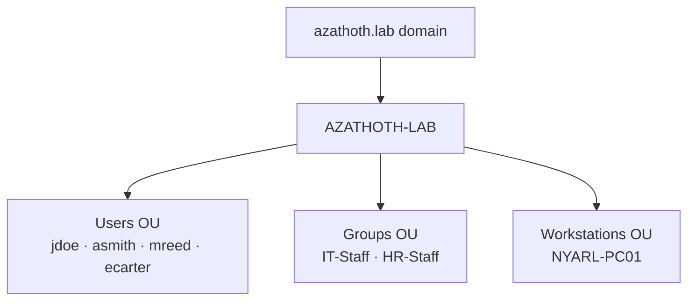

The Organizational Unit (OU) structure separates user accounts, security groups, and domain-joined workstations for easier administration and Group Policy targeting.

### Users and Security Groups

| User | Username | Security Group | Purpose |
|---|---|---|---|
| John Doe | `jdoe` | `IT-Staff` | Authorized IT user |
| Alice Smith | `asmith` | `HR-Staff` | Unauthorized comparison user for IT resource testing |

### Group Policy

- Created the `Restrict Control Panel - Users` Group Policy Object (GPO)
- Linked the GPO to the `Users` Organizational Unit (OU)
- Updated Group Policy on `NYARL-PC01`
- Verified that the Control Panel restriction applied to `jdoe`
- Confirmed the applied GPO with `gpresult`

### Secure File Share

- Created the folder `C:\Shares\IT-Share` on `AZATHOTH-DC01`
- Published it as `\\AZATHOTH-DC01\IT-Share`
- Granted `IT-Staff` Change share permission
- Granted `Domain Admins` Full share permission
- Granted `IT-Staff` Modify NTFS permission
- Limited the parent `C:\Shares` folder to `Administrators` and `SYSTEM`
- Verified that `jdoe` could open the share and create, modify, and delete a test file
- Verified that `asmith`, a member of `HR-Staff`, was denied access

### File-Share Troubleshooting

The parent folder `C:\Shares` was initially shared instead of the intended child folder `C:\Shares\IT-Share`. Connectivity to SMB port 445 was verified with `Test-NetConnection`, available shares were inspected with `net view`, and the incorrect share path was identified with `Get-SmbShare`. The parent share was removed and the intended `IT-Share` was then published with the correct permissions.

## Completed Work

- Enabled Hyper-V
- Created the isolated `AD-Lab` virtual network
- Created and configured the Windows Server virtual machine
- Installed Windows Server 2025
- Renamed the server to `AZATHOTH-DC01`
- Assigned the server static IP address `10.10.10.10`
- Installed Active Directory Domain Services
- Promoted `AZATHOTH-DC01` to a Domain Controller
- Created the `azathoth.lab` domain
- Installed and configured Domain Name System
- Created the Windows 11 Pro client virtual machine
- Renamed the client to `NYARL-PC01`
- Assigned the client static IP address `10.10.10.20/24`
- Configured the client to use `10.10.10.10` for DNS
- Verified network connectivity between the client and Domain Controller
- Verified DNS resolution for `azathoth.lab`
- Joined `NYARL-PC01` to the `azathoth.lab` domain
- Verified domain membership after restarting the client
- Created the `AZATHOTH-LAB` Organizational Unit (OU)
- Created `Users` and `Workstations` child OUs
- Moved the `NYARL-PC01` computer account into the `Workstations` OU
- Created a dedicated `Groups` Organizational Unit (OU) under `AZATHOTH-LAB`
- Organized `John Doe`, `IT-Staff`, and `NYARL-PC01` into their appropriate OUs
- Removed obsolete empty OUs after verifying their contents
- Successfully signed in to `NYARL-PC01` with the domain account `jdoe`
- Verified the signed-in domain identity using `whoami`
- Verified active membership in the `IT-Staff` security group
- Created the `HR-Staff` global security group
- Created the `asmith` domain user for Alice Smith
- Added Alice Smith to the `HR-Staff` security group
- Created and linked the `Restrict Control Panel - Users` Group Policy Object (GPO)
- Verified the user policy on `NYARL-PC01` with `gpresult`
- Created and secured the `IT-Share` Server Message Block (SMB) file share
- Configured share and NTFS permissions using domain security groups
- Verified authorized create, modify, and delete access for `jdoe`
- Verified access denial for unauthorized user `asmith`
- Diagnosed and corrected an incorrect parent-folder share configuration

## Departmental File Shares and Mapped Drives

A second departmental file share was created to demonstrate role-based access control and centralized drive deployment.

### HR Department Share

- Created `C:\Shares\HR-Share` on `AZATHOTH-DC01`
- Shared the folder as `\\AZATHOTH-DC01\HR-Share`
- Granted the `HR-Staff` security group Modify access
- Granted `Domain Admins` Full Control
- Removed general `Everyone` access
- Verified that Alice Smith (`asmith`) could create, edit, and delete files
- Verified that John Doe (`jdoe`) was denied access

### Departmental Drive Mapping

Created and linked the `Map Department Drives` Group Policy Object (GPO) to the `AZATHOTH-LAB\Users` Organizational Unit (OU).

Group Policy Preferences were configured with item-level targeting:

- `IT Department (I:)` maps to `\\AZATHOTH-DC01\IT-Share` for members of `IT-Staff`
- `HR Department (H:)` maps to `\\AZATHOTH-DC01\HR-Share` for members of `HR-Staff`

Validation confirmed:

- John Doe received only the `I:` drive
- Alice Smith received only the `H:` drive
- Unauthorized departmental drives were not displayed

## Security Hardening and Administrative Controls

Additional domain and workstation security controls were configured and validated.

### Domain Account Lockout Policy

The Default Domain Policy was configured with the following account-lockout settings:

- Account lockout threshold: 5 invalid sign-in attempts
- Account lockout duration: 15 minutes
- Failed-attempt counter reset: 15 minutes
- Administrator account lockout: Enabled

The effective settings were verified with:

```powershell
Get-ADDefaultDomainPasswordPolicy |
    Select-Object LockoutThreshold, LockoutDuration, LockoutObservationWindow
```

## Validation Evidence

### Domain Controller and Directory Services

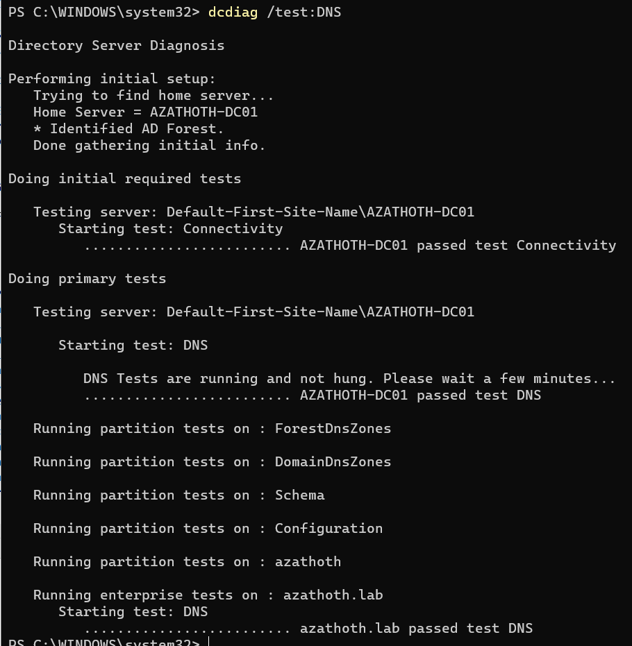

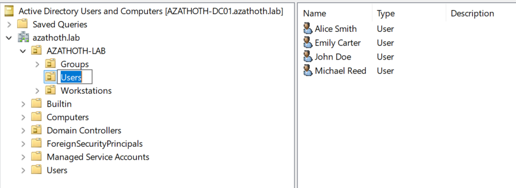

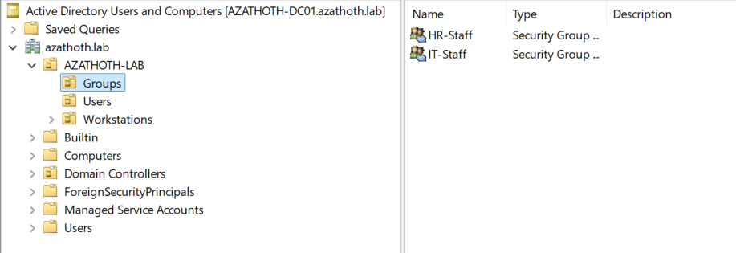

### Group Policy

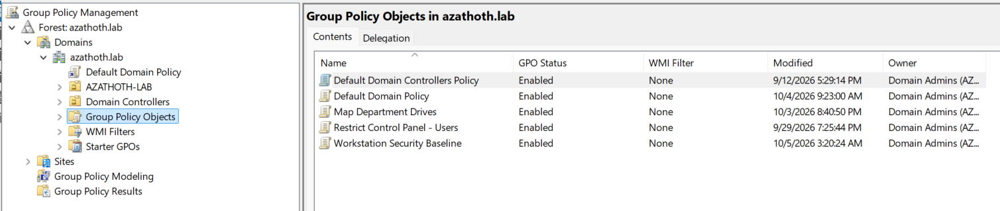

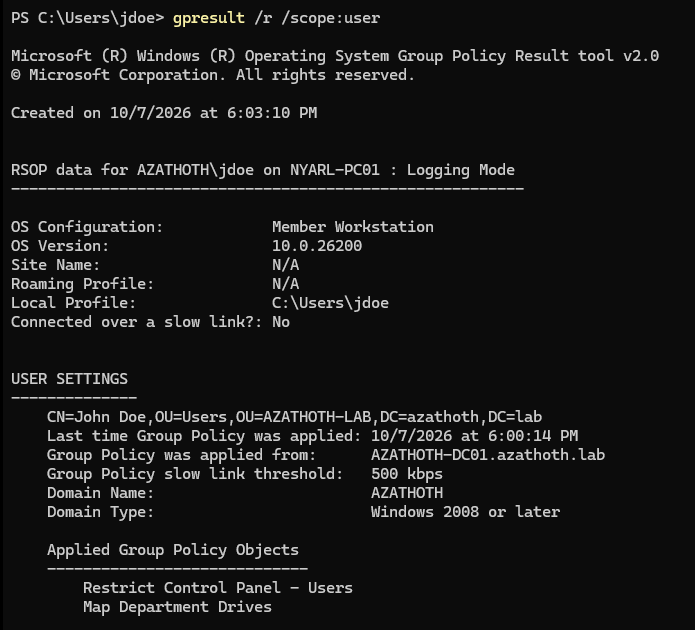

### Client Connectivity and Access Control

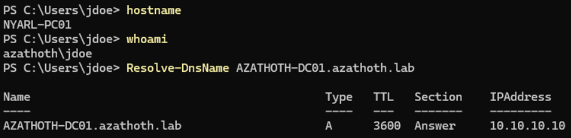

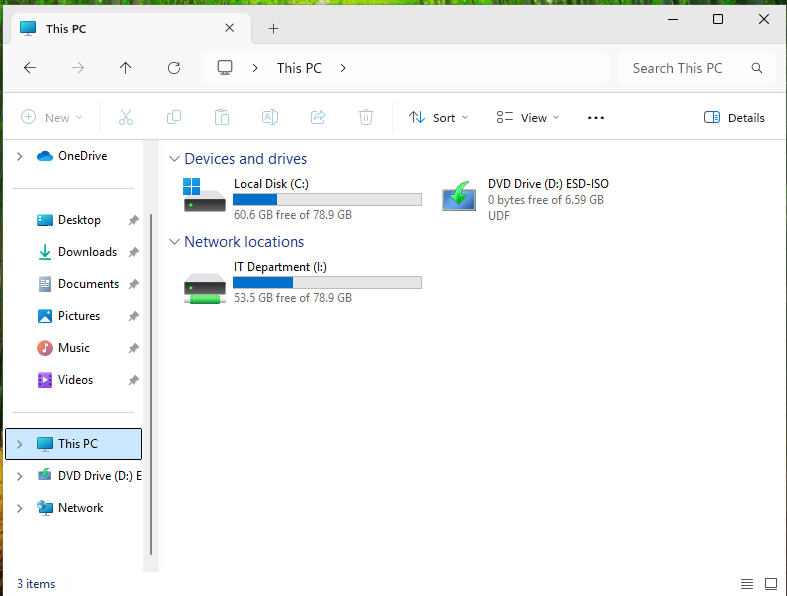

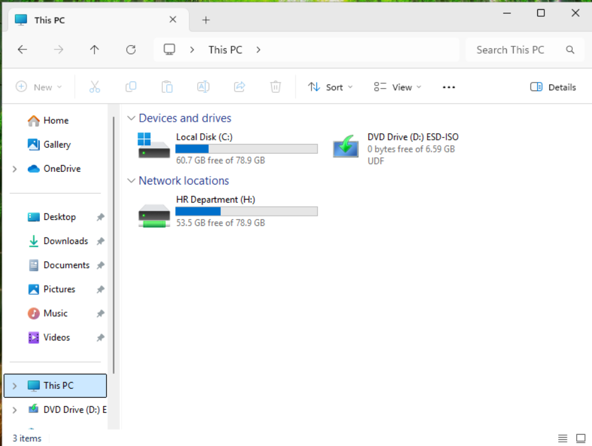

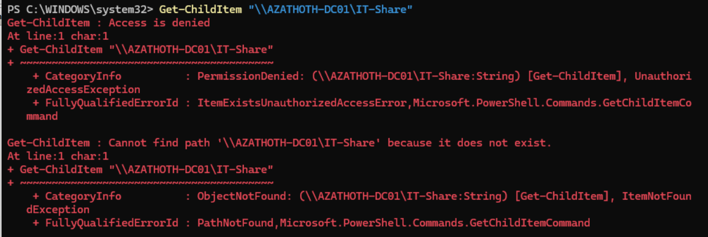

## Project Status

The core lab build, security configuration, PowerShell automation, access-control testing, and final validation are complete.

## PowerShell User Automation

Created and tested a PowerShell workflow that imports user information from a CSV (Comma-Separated Values) file and automatically provisions Active Directory accounts.

The automation:

- Imports first name, last name, username, department, and group information from a CSV file
- Creates enabled user accounts in the `Users` Organizational Unit (OU)
- Assigns each account to its correct departmental security group
- Requires users to change their temporary password at first sign-in
- Prompts for the password securely instead of storing it in the script or repository
- Verifies that the requested security group exists before creating the account
- Detects existing usernames and skips them to prevent duplicate accounts
- Displays clear success, warning, and error messages

Validation completed:

- Created `mreed` with the IT department and `IT-Staff` membership
- Created `ecarter` with the HR department and `HR-Staff` membership
- Confirmed both accounts were enabled and placed in the correct Organizational Unit
- Reran the script and confirmed both duplicate accounts were safely skipped

Automation files:

- [Create-ADUsers.ps1](automation/Create-ADUsers.ps1)
- [NewUsers.csv](automation/NewUsers.csv)

## Skills Demonstrated

- Hyper-V virtualization
- Virtual machine provisioning
- TCP/IP network configuration
- Static IPv4 addressing
- Active Directory Domain Services
- Domain Name System
- Windows Server administration
- Windows client configuration
- Network connectivity testing
- DNS troubleshooting
- Infrastructure planning
- Technical documentation
- Git and GitHub version control
- PowerShell automation
- CSV-driven Active Directory account provisioning
- Input validation and duplicate-account prevention

## Group Policy Configuration and Validation

Created and tested a Group Policy Object (GPO) to restrict standard domain users from accessing Control Panel and Windows Settings.

- GPO name: `Restrict Control Panel - Users`
- Linked to the `AZATHOTH-LAB/Users` Organizational Unit (OU)
- Enabled `Prohibit access to Control Panel and PC settings`
- Refreshed policies on `NYARL-PC01` with `gpupdate /force`
- Verified the applied policy with `gpresult /r /scope:user`
- Confirmed that Control Panel access was blocked for domain user `AZATHOTH\jdoe`
